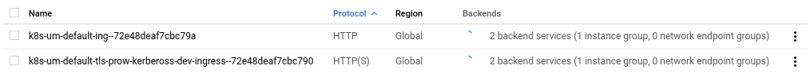
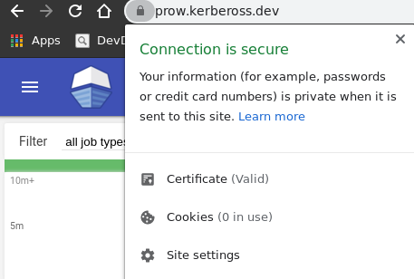

# Deploy SSL certificate manifests

**DISCLAIMER**: Before apply the manifests ensure you have reviewed it in order to match the external IP of your ingresses and the desired name for your resources

- We need at first to create the Let's Encrypt issuer into our cert-manager
```
kubectl create -f le-clusterissuer.yaml
```

And the result will be something like this:
```
kubectl get clusterissuer

--------
NAME               READY   AGE
letsencrypt-prod   True    11h
```

Ensure the status of clusterissuer is `Ready == True`, just to validate that cert-manager has the enough resources to start dealing with ACME-DNS validation.

**NOTE**: The ClusterIssuer vs Issuer difference it's just the scope of the issuer actuation, Cluster one will act over the while cluster and Issuer will just cover the namespace.

After that, we need to create the certificate:
```
kubectl create -f le-certificate.yaml
```

This is important, ensure the Certificate finishes as `READY == True`
```
NAME                 READY   SECRET                    AGE
kerbeross-cert       True    default                   19h
prow-kerbeross-dev   True    cert-prow-kerbeross-dev   11h
```

Usually takes like 3 minutes to be validated by Let's Encrypt

- Some more info about how validation works:
    - https://www.eff.org/deeplinks/2018/02/technical-deep-dive-securing-automation-acme-dns-challenge-validation
    - And also a [GitHub Issue](https://github.com/jetstack/cert-manager/issues/2209) that helps me on a stuck state

To debug the status of the certificate the `kubectl describe certificate xxxx` or `kubectl get events` will help you

Perfect you could continue with the ingress, in our case we are on GCE, then we need to specify the ingress type on the certificate (we already did it)

And now we need to apply the patched default ingress of Prow:

- The default ingress:
```
apiVersion: extensions/v1beta1
kind: Ingress
metadata:
  name: ing
  namespace: default
spec:
  backend:
    serviceName: deck
    servicePort: 80
  rules:
  - http:
      paths:
      - backend:
          serviceName: deck
          servicePort: 80
        path: /
      - backend:
          serviceName: hook
          servicePort: 8888
        path: /hook
```

- vs the patched one:
```
---
apiVersion: extensions/v1beta1
kind: Ingress
metadata:
  name: tls-prow-kerbeross-dev-ingress
spec:
  tls:
  - hosts:
    - prow.kerbeross.dev
    secretName: cert-prow-kerbeross-dev
  backend:
    serviceName: deck
    servicePort: 80
  rules:
    - host: prow.kerbeross.dev
      http:
        paths:
        - backend:
            serviceName: deck
            servicePort: 80
          path: /
        - backend:
            serviceName: hook
            servicePort: 8888
          path: /hook

```

This will create a load balancer on GCE just wait a bit to the external IP on the ingress



```
NAME                             HOSTS                ADDRESS          PORTS     AGE
ing                              *                    xx.xxx.xxx.xx    80        24h
tls-prow-kerbeross-dev-ingress   prow.kerbeross.dev   xx.xxx.xxx.xx    80, 443   11h
```

Aaaaaaand that's it:



**NOTE**: You could erase the other ingress to save some money :)
